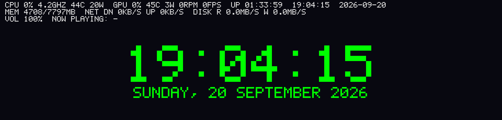
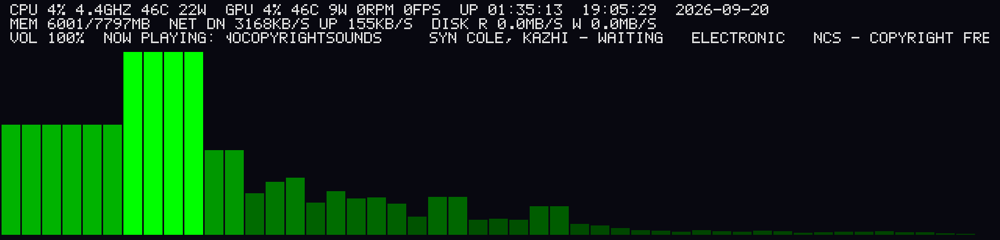

# trofeo_lcd

**English** · [Bahasa Indonesia](./README.id.md)

Audio visualizer + system info monitor for the **Thermalright Trofeo Vision
9.16 LCD** (USB `0416:5408`, "LY" protocol). The driver was rewritten
byte-for-byte from [thermalright-trcc-linux](https://github.com/Lexonight1/thermalright-trcc-linux).

The Trofeo LCD showing what's on screen in its three default modes:

**Idle** — audio is quiet, so the EQ bars are low and the top bar shows
system info: CPU usage & real-time frequency, RAM, uptime, clock and date.



**Media** — a song is playing: the stripes follow the music, and the top bar
shows the now-playing track (title/artist/album from the media controls).



**Gaming** — a game is in the foreground: game info is detected and the
system status (CPU/GPU/RAM/temp) stays readable while playing.


## Features

- EQ bars (48) from currently playing audio (WASAPI loopback on Windows,
  PulseAudio/PipeWire on Linux), colored green→yellow→red.
- System info: CPU %, real-time CPU frequency, RAM, uptime, clock & date.
- Can also drive a **DeepCool** display (sends CPU data over HID).
- **Second monitor mode** (`trofeo_screen`): the LCD becomes a real second
  monitor.
- Sync EQ bar color with an **OpenRGB** device.
- Adaptive FPS: drops to idle when silent → saves CPU.

## Usage

```bash
cargo build --release
./target/release/trofeo_lcd      # Windows: .\target\release\trofeo_lcd.exe
```

**Windows** — to read AMD CPU temp/power, install
[PawnIO](https://github.com/namazso/PawnIO) and run as Administrator.

**Linux** — needs `pkg-config` + PulseAudio headers to build, and
`playerctl` for song titles. For USB access without `sudo`, install
`99-trofeo-lcd.rules` (see the file's contents).

## Main options

| Option | Purpose | Default |
|---|---|---|
| `--idle-fps` / `--active-fps` | FPS when idle / has sound | `2` / `15` |
| `--no-deepcool` | Turn off DeepCool integration | enabled |
| `--deepcool-update-ms` | DeepCool send interval (100–2000 ms) | `1000` |
| `--openrgb-device <NAME>` | Sync color with an OpenRGB device | disabled |
| `--hide-console` | Hide the console window (Windows) | disabled |
| `-k, --screenshot-key` | Global hotkey to save the current LCD frame as a lossless PNG screenshot (f1-f12, printscreen) | off |

## Second monitor mode

Run **`trofeo_screen`** (instead of `trofeo_lcd` — they share the LCD, so
don't run them together):

```bash
./target/release/trofeo_screen --list-displays    # list monitors
./target/release/trofeo_screen                    # stream to LCD
```

Requires a *Virtual Display Driver* (VDD) at 1920×462 — see
**[GUIDE_SECOND_MONITOR.md](./GUIDE_SECOND_MONITOR.md)**.

## Structure

- `src/lib.rs` — USB driver: handshake, chunking, JPEG encode, `Framebuffer`.
- `src/audio.rs` — audio capture (WASAPI / PulseAudio-PipeWire).
- `src/cpu_sensor.rs`, `src/cpu_freq.rs` — CPU temp/power & frequency.
- `src/deepcool/` — DeepCool display drivers (HID).
- `src/dxgi_capture.rs` + `src/bin/screen.rs` — second monitor mode.
- `src/main.rs` — main loop: audio → FFT → EQ bars → send to screen.

## Performance

Measured on a Windows PC (12 logical processors), running `trofeo_lcd` at
default settings (idle FPS 2 / active 15, DeepCool enabled):

| Metric | Measured |
|---|---|
| RAM | ~13 MB working set (stable, no growth) |

It stays this light thanks to adaptive FPS (JPEG encode + USB transfer only
happen while there is audio) and the CPU optimizations in `src/main.rs` /
`src/lib.rs`.

## License

GPL-3.0-or-later (follows the referenced upstream project).